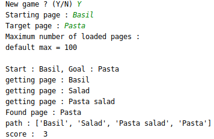

# This project aims at making a bot play the Wikipedia game

A Python script to play the [WikiGame](https://en.wikipedia.org/wiki/Wikipedia:Wiki_Game)
automatically.

## Strategies :
* **Random** : If the end page is not found, chooses a random link  
        _Unlikely to succeed_  
        
* **With NLP** : Chooses the word closest to the target in the page using similarity computed with spacy
    * **Max** : similarity is computed as the max similarity between words from the two strings  
        _Could get stuck in pages about Turkey (country) when trying to get to Bacon_
        
    * **Mean** : Similarity is computed as the average similarity between verds from the two strings  
        _Better when facing the previous issue_

## Tools:
* Request to call the Wikipedia API
* BeautifulSoup to parse html
* Spacy to find similarities with NLP

## Choose a spacy ressource :
Download ressource (https://spacy.io/models/en) :  
* Small :  
python -m spacy download en_core_web_sm  
* Medium :  
python -m spacy download en_core_web_md  
* Large :  
python -m spacy download en_core_web_lg  

In spacyTools.py choose between 'sm', 'md' and 'lg' by editing the following line :  
nlp = spacy.load('en_core_web_lg')

## Run :
python main.py

## Example : 

